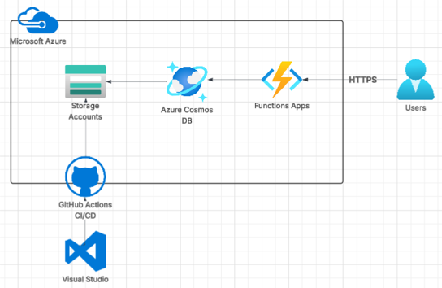

# ☁️ Azure Cloud Resume Challenge

This is my personal take on the Cloud Resume Challenge, but my version is using Python, inspired by the ACG project and built entirely on Microsoft Azure. It’s a static website hosted on Azure Storage, with a visitor counter powered by Azure Functions and Cosmos DB.

🔗 [Patryk Nowak CV](https://azureresumestaticwebsite.z19.web.core.windows.net/)  
📁 [Source Code](https://github.com/Patryk94A/azure-cloud-resume)

---

## 🧱 Architecture Overview

[Azure Resume Architecture]

---

## 📁 Project Structure

- `frontend/` — Static website with HTML resume and JavaScript visitor counter  
- `main.js` — Fetches visitor count from Azure Function  
- `index.html` — Resume in HTML format  
- `api/` — Python Azure Function that connects to Cosmos DB  
- `.github/workflows/` — CI/CD pipelines for deploying frontend

---

## ⚙️ Backend Functionality

- Azure Function triggered via HTTP  
- Connects to Cosmos DB using Python SDK  
- Retrieves visitor count and increments it  
- Returns JSON response to frontend

## 📚 References & Learning Resources
Main Resource\
https://github.com/madebygps/azure-resume/tree/main

CosmosDB bindings to Azure Functions\
https://learn.microsoft.com/en-us/azure/azure-functions/functions-bindings-cosmosdb-v2?tabs=isolated-process%2Cextensionv4&pivots=programming-language-python


Github CI/CD to deploy static website\
https://learn.microsoft.com/en-us/azure/storage/blobs/storage-blobs-static-site-github-actions?tabs=openid

### 🔧 Python Fix
There were a lot of errors, but main was with Python version :D\
Resolved error:  
`ERROR: unhandled error in functions worker: '_SixMetaPathImporter' object has no attribute '_path'`  
✅ Solution: Downgraded Python to `3.11.9`

Another one i was struggling:\

Initial response returned plain text:
```python
return func.HttpResponse(f"Document found: id={item['id']}, count={count}")
so instead of python dict:
{'id': '1', 'count': 42}

It had to return json.dumps(body) in json format:
{"id": "1", "count": 42}